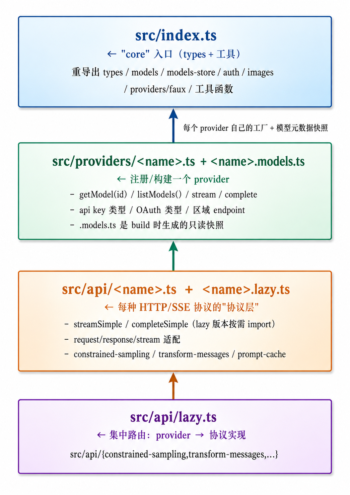

位置：[`packages/ai`](../packages/ai)

## 1. 解决的问题

`@earendil-works/pi-ai` 是 LLM 调用与适配层，不是 Agent。

它把不同服务商的请求格式、消息格式、流式响应、鉴权、模型元数据和错误行为，统一成一套 TypeScript 类型与调用协议。Agent 层只需要处理统一的 `Context`、`AssistantMessage` 和 `AssistantMessageEventStream`，不需要直接理解 Anthropic、OpenAI、Google 或 Bedrock 的线协议。

它主要提供：

- Provider 集合与 Provider 工厂；
- 模型目录、模型能力和模型成本定义；
- Anthropic、OpenAI、Google、Bedrock、Mistral 等 API 适配；
- API Key、环境变量、OAuth 和 Credential Store；
- 文本、Thinking、Tool Call 的流式事件；
- 部分 JSON 的增量解析与工具 Schema 校验辅助；
- Token、Prompt Cache、Cost 和 Stop Reason 归一化；
- 图片输入和独立的图片生成子系统；
- Retry、Abort、Proxy、Header 和 Provider 兼容性处理；
- 动态模型目录刷新与持久化；
- 延迟响应和跨 Provider 上下文转换；
- Faux Provider，供 Agent 和回归测试使用。

一句话概括：

> `pi-ai` 将“服务商运行时 + 模型元数据 + 上游协议适配 + 鉴权”组合起来，对外提供统一的消息和流式调用接口。

## 2. 分层架构



当前最重要的是四个职责边界：

```text
Model       纯数据：某个具体模型的能力、地址、价格和兼容性
Provider    运行时：某个服务商的模型列表、鉴权和请求分发
Api         线协议：把 Context 转为上游请求，并把响应转为统一事件
Models      编排器：注册 Provider、解析鉴权、选择 Provider、提供调用入口
```

源码位置：

- 核心类型：[`src/types.ts`](../packages/ai/src/types.ts)
- `Models`、`Provider` 和 `createProvider()`：[`src/models.ts`](../packages/ai/src/models.ts)
- 内置 Provider 集合：[`src/providers/all.ts`](../packages/ai/src/providers/all.ts)
- API 适配器：[`src/api/`](../packages/ai/src/api/)
- 鉴权系统：[`src/auth/`](../packages/ai/src/auth/)
- 图片模型集合：[`src/images-models.ts`](../packages/ai/src/images-models.ts)

根入口保持相对轻量，不自动注册全部内置 Provider。需要完整集合时显式导入 `providers/all`；需要小体积构建时只导入目标 Provider。示例见 [`agent-treeshake-smoke-entry.ts`](../scripts/agent-treeshake-smoke-entry.ts)。

## 3. 一次文本请求的调用链

```text
Models.stream(model, context, options)
        ↓
根据 model.provider 找到 Provider
        ↓
通过 Provider.auth 解析 API Key / OAuth / 环境配置
        ↓
合并 Provider、Model 和请求级 headers；必要时覆盖 baseUrl
        ↓
Provider.stream() 或 Provider.streamSimple()
        ↓
根据 model.api 选择 API 实现
        ↓
lazy 加载 SDK，组装上游请求
        ↓
将上游响应解析为 AssistantMessageEvent
        ↓
以 done 或 error 结束
```

`complete()` 和 `completeSimple()` 不是另一套非流式协议，它们内部等待流的 `.result()`，最后得到 `AssistantMessage`。普通请求的失败也不会直接从流函数抛出，而是编码为 `error` 事件和一个 `stopReason` 为 `error` 或 `aborted` 的最终消息。

## 4. 核心概念

### 4.1 Model / Provider / Api / Models

`Model<Api>` 描述一个具体模型，是可序列化的纯数据，不包含请求方法。主要字段包括 `id`、`name`、`api`、`provider`、`baseUrl`、`headers`、`reasoning`、`thinkingLevelMap`、`input`、`cost`、`contextWindow`、`maxTokens` 和 `compat`。

当前内置 `KnownApi` 包括：

```text
openai-completions
openai-responses
openai-codex-responses
azure-openai-responses
anthropic-messages
google-generative-ai
google-vertex
mistral-conversations
bedrock-converse-stream
pi-messages
```

`Api` 是可扩展字符串联合类型，所以自定义 Provider 也可以使用自定义 API ID。

`Provider` 是服务商运行时，负责暴露 `getModels()`、`auth`、`stream()`、`streamSimple()`，以及可选的动态模型刷新、凭据相关模型过滤和延迟响应。`Models` 是多个 Provider 的运行时集合，负责注册 Provider、根据 `model.provider` 路由请求、解析鉴权、合并请求配置，并提供 `getModel()`、`complete()` 等便利方法。

因此，OpenRouter 是 Provider，不是 Api；它当前复用 `openai-completions`。一个 Provider 也可能支持多个 Api，例如 GitHub Copilot、OpenCode 和 Cloudflare AI Gateway。`Provider<TApi>` 的泛型主要服务于静态类型检查；动态查找的模型通常需要使用 `hasApi()` 缩小类型。

### 4.2 消息、内容块和上下文

`Message` 是 `UserMessage | AssistantMessage | ToolResultMessage`。内容块包括 `TextContent`、`ThinkingContent`、`ImageContent` 和 `ToolCall`。

`ToolResultMessage` 是顶层消息，不是 `AssistantMessage.content` 中的内容块。它可以包含文本和图片，并通过 `toolCallId` 对应之前的工具调用。

`Context` 包含 `systemPrompt`、`messages` 和可选的 `tools`。`Tool` 使用 TypeBox Schema 描述参数。`pi-ai` 负责工具格式转换和参数校验辅助；工具真正的执行由 Agent 层负责。

### 4.3 流事件

统一入口是：

```ts
stream(model, context, options): AssistantMessageEventStream
```

实际事件协议是：

```text
start
text_start / text_delta / text_end
thinking_start / thinking_delta / thinking_end
toolcall_start / toolcall_delta / toolcall_end
done 或 error
```

文本、Thinking 和工具参数都通过 `contentIndex` 指向 `partial.content` 中的内容块。不同内容块的事件可能交错，消费方不能假设某个块的 start/delta/end 期间不会出现其他块的事件。

`toolcall_delta` 中的参数是尽力解析的部分 JSON，字段可能不完整；`toolcall_end` 时参数完整，但仍需要经过工具 Schema 校验后才能执行。

`AssistantMessageEventStream` 是异步事件队列，同时提供 `.result()`。`result()` 会在 `done` 或 `error` 事件到达后返回最终 `AssistantMessage`。

### 4.4 `streamSimple()` 与 API 专用选项

`streamSimple()` 不是“简单的流”，而是 Provider 无关的高级接口。它接收统一的 `reasoning: "minimal" | "low" | "medium" | "high" | "xhigh" | "max"`，再转换成不同上游的 `reasoning_effort`、Anthropic thinking、Gemini thinking 或 DeepSeek/Qwen/ZAI 的自定义字段。

`stream()` 接收具体 API 的完整选项，例如 Anthropic 的 `thinkingEnabled`、OpenAI Responses 的 `reasoningEffort`。`model.reasoning` 只是能力元数据，不会自动开启 Thinking。

### 4.5 Usage、Cost 和 StopReason

`Usage` 统一记录 input/output/cacheRead/cacheWrite/totalTokens/cost。价格来自 `Model.cost`，单位是每百万 Token；`calculateCost()` 支持价格阶梯和 Anthropic 长缓存写入价格。

`StopReason` 包括 `pending`、`stop`、`length`、`toolUse`、`error`、`aborted` 和 `deferred`。其中 `deferred` 表示请求先返回 `DeferredHandle`，稍后通过 `fetchDeferred()` 获取结果。

### 4.6 图片输入与图片生成

图片输入属于聊天模型的输入能力：`Model.input` 包含 `image` 时，`UserMessage` 或 `ToolResultMessage` 可以包含 `ImageContent`。如果目标模型不支持图片，消息转换层会将图片降级为占位文本。

图片生成是完全独立的子系统，不是文本 `Models` 中带有 `output: ["image"]` 的子集：

```text
ImagesModel / ImagesProvider / ImagesModels / AssistantImages
```

调用方法是 `generateImages()`，返回 `AssistantImages`，图片输出位于 `AssistantImages.output`。当前内置图片 API 是 `openrouter-images`，当前内置图片 Provider 是 OpenRouter。`getImageModel()` 属于旧的静态图片目录入口；新代码应使用 `builtinImagesModels()` 或 `createImagesModels()`。

### 4.7 模型目录与动态刷新

静态内置目录由生成脚本维护。`generate-models.ts` 会合并 models.dev、Provider 专用接口和手工兼容性修正，生成：

```text
src/providers/data/*.json
src/providers/*.models.ts
src/models.generated.ts
```

这些生成文件不应直接手工修改，应修改生成脚本或数据源后重新生成。

`Models.getModels()` 和 `Models.getModel()` 是同步读取当前已知目录，不负责网络请求。动态 Provider 可以实现 `refreshModels()`；`Models.refresh()` 负责缓存恢复、鉴权、网络刷新、持久化、并发控制、取消和错误收集。

`getAvailable()` 与 `getModels()` 不同：前者会确认 Provider 已配置鉴权，并应用 Provider 的凭据相关模型过滤。

### 4.8 鉴权

Provider 的鉴权类型是 `ProviderAuth { apiKey?: ApiKeyAuth; oauth?: OAuthAuth }`。Credential 目前只有 `api_key` 和 `oauth` 两种，没有单独的 `NoAuth` 或 `Custom` 鉴权联合类型。

无密钥本地服务、AWS 凭据链等场景，通常仍通过 `ApiKeyAuth.resolve()` 表达；它可以返回空的 `auth`，表示请求依赖环境或 SDK 的 ambient credentials。

鉴权来源可能包括请求级配置、注入的 `CredentialStore`、环境变量、AWS Profile、AWS credential chain、Google ADC 以及 OAuth 登录和刷新。

请求级配置优先级大致是：

```text
Provider auth → Model headers → 请求级 headers → transformHeaders
```

存储凭据后，CredentialStore 中的凭据拥有该 Provider；OAuth 刷新失败时不会悄悄回退到环境变量。OAuth 刷新在串行的 `modify()` 中执行，以避免并发请求重复刷新 Token。

`AuthContext` 只抽象环境变量读取和文件存在性检查；settings、keychain 或文件持久化由应用注入的 `CredentialStore` 实现负责。包内默认是内存 CredentialStore。

### 4.9 Lazy、Tree Shaking 与 Bedrock

Provider 工厂通常引用 `api/*.lazy.ts`，API 的 SDK 在第一次实际请求时加载。这样只使用一个 Provider 的应用可以避免引入其他 Provider 的 SDK。

Bedrock 的 Node-only AWS SDK 通过 bundler 不易追踪的动态导入加载。`bedrock-provider` 不是另一套鉴权系统，而是为 Bun 或单文件构建提供显式的 Bedrock 实现模块覆盖入口。

### 4.10 Faux Provider

Faux Provider 是内存中的假 Provider，可以按队列返回预先编排的文本、Thinking 和工具调用，并模拟流式增量、Usage、Prompt Cache、Abort 和 deferred response。Agent 和 coding-agent 的测试大量使用 Faux 辅助函数，但部分 coding-agent 测试也有自己的 `createFauxStreamFn`。

### 4.11 跨 Provider 转换

`transformMessages()` 会根据目标模型处理不同 Provider 的 Thinking 签名、工具调用 ID、图片能力、消息顺序、工具结果和延迟工具格式。切换 Provider 时，某些 Thinking 或签名可能被转换为普通文本或被丢弃。

### 4.12 `compat` 旧接口

`@earendil-works/pi-ai/compat` 保留旧的全局 API：全局 API registry、根据 `model.api` 分发 `stream()` / `complete()`、静态 `getModel()` / `getModels()` / `getProviders()`、环境变量 API Key 注入、旧版 API 别名和图片生成入口。

新代码优先使用：

```ts
createModels()
providerFactory()
models.setProvider(provider)
models.stream() / models.complete()
```

## 5. 公共工具的准确职责

- `event-stream`：异步事件队列、迭代和最终结果承诺；
- `json-parse`：部分 JSON 和带修复能力的 JSON 解析；
- `overflow`：识别上下文溢出和可恢复的 length stop，不是通用参数截断器；
- `retry`、`provider-retry`：通用和 Provider 请求重试；
- `validation`、`typebox-helpers`：TypeBox Schema 校验和转换；
- `transform-messages`：跨 Provider 消息与能力转换；
- `estimate`：上下文 Token 估算；
- `headers`、`provider-env`：请求头和 Provider 级环境处理；
- `abort`：请求取消和 AbortSignal 协调；
- `contentText`：从混合内容块中提取文本；
- `uuid`：生成 UUID v7。

## 6. 阅读源码的建议顺序

1. 先读 [`types.ts`](../packages/ai/src/types.ts)：理解数据协议和事件协议。
2. 再读 [`models.ts`](../packages/ai/src/models.ts)：理解 `Models` 如何解析鉴权和分发 Provider。
3. 读 [`providers/openai.ts`](../packages/ai/src/providers/openai.ts) 和 [`providers/anthropic.ts`](../packages/ai/src/providers/anthropic.ts)：理解 Provider 工厂如何组装模型、鉴权和 API。
4. 读 [`api/openai-completions.ts`](../packages/ai/src/api/openai-completions.ts) 或 [`api/anthropic-messages.ts`](../packages/ai/src/api/anthropic-messages.ts)：理解消息转换、上游响应解析和统一事件生成。
5. 最后读 [`api/transform-messages.ts`](../packages/ai/src/api/transform-messages.ts)、[`auth/resolve.ts`](../packages/ai/src/auth/resolve.ts) 和动态 Provider [`providers/radius.ts`](../packages/ai/src/providers/radius.ts)。

最重要的判断标准是：看到一个功能时，先问它属于纯数据模型、Provider 运行时、Api 线协议，还是 Models 编排器。这样不容易把 `Provider`、`Api`、`Models` 和 `compat` 混在一起。
